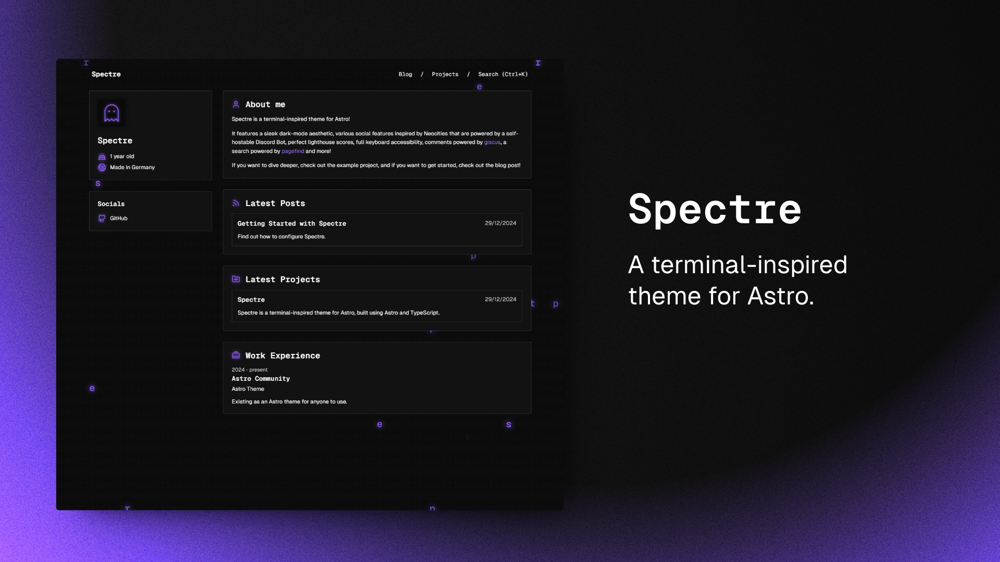

# devnose — Personal Portfolio & Digital Garden



A minimalist, terminal-inspired personal website built with **Astro 5** and the **Spectre** theme. Portfolio, blog, and digital garden for Christian Sadik.

**Live:** [christiansadik.dev](https://christiansadik.dev)  
**Brand:** devnose

---

## Features

- ✨ **100/100 Lighthouse** performance
- 🎨 **Night Owl** color palette (terminal aesthetic)
- 📝 **Markdown/MDX** for blog posts and content
- 🔍 **Pagefind** client-side search
- 💬 **Giscus** comments (GitHub Discussions)
- 📱 **Fully responsive** design
- ♿ **WCAG AA** accessibility
- ⚡ **Static generation** (zero server cost)
- 🚀 **Netlify** deployment ready

---

## Tech Stack

### Frontend
- **Astro 5** — Static site generator
- **TypeScript** — Type-safe code
- **CSS** — Native styling (no Tailwind)
- **Expressive Code** — Enhanced code blocks

### Content
- **Markdown/MDX** — Blog posts & pages
- **Content Collections** — Type-safe content with Zod
- **Pagefind** — Post-build search index

### Integrations
- **Netlify Forms** — Contact form
- **Giscus** — Comments via GitHub Discussions
- **Auto Sitemap** — SEO-friendly sitemap

### Tools
- **Biome** — Linting & formatting
- **pnpm** — Fast package manager
- **GitHub** — Version control

---

## Project Structure

```
src/
├── assets/              # Images, fonts
├── components/          # Reusable Astro components
├── content/             # Content collections
│   ├── posts/          # Blog articles (MDX)
│   ├── projects/       # Portfolio projects
│   ├── info.json       # Quick info cards
│   ├── socials.json    # Social links
│   ├── skills.json     # Tech stack & languages
│   ├── work.json       # Work experience
│   ├── tags.json       # Blog tags
│   └── other/          # About, etc.
├── layouts/            # Page layouts
├── pages/              # Routes (file-based)
├── scripts/            # Client-side JS
├── styles/             # Global CSS
├── content.config.ts   # Content schemas (Zod)
└── ec-theme.ts         # Expressive Code theme
```

---

## Quick Start

### Prerequisites

- **Node.js** 20+
- **pnpm** 10+ ([install](https://pnpm.io/installation))

### Installation

```bash
# Clone repository
git clone git@github.com:YOUR_USERNAME/devnose.git
cd devnose

# Install dependencies
pnpm install

# Start dev server
pnpm dev
```

Dev server: \`http://localhost:4321\`

### Build for Production

```bash
pnpm build
pnpm preview
```

---

## Writing Content

### Blog Posts

Create files in \`src/content/posts/\`:

```mdx
---
title: "My First Post"
description: "A short description"
createdAt: 2026-03-01
tags: ["coding", "tools"]
draft: false
---

# Content in Markdown/MDX

Your article here...
```

### Projects

Create files in \`src/content/projects/\`:

```mdx
---
title: "My Project"
description: "Project description"
date: 2026-03-01
link: "https://example.com"
info:
  - text: "React"
    icon: { type: "simple-icons", name: "react" }
---

Project details...
```

### Update Content Data

Edit JSON files in \`src/content/\`:
- \`info.json\` — Quick info cards on homepage
- \`socials.json\` — Social media links
- \`skills.json\` — Tech stack & languages
- \`work.json\` — Work experience
- \`tags.json\` — Blog categories

---

## Git Workflow (Git Flow Manual)

No \`git-flow\` tool — commands done manually on Fedora.

### Create Feature Branch

```bash
git checkout develop
git pull origin develop
git checkout -b feature/feature-name
```

### Commit Convention

```
feat(scope): add new feature
fix(scope): resolve bug
docs(scope): update documentation
```

### Merge Back

```bash
git push origin feature/feature-name
# Create PR on GitHub
# Review → Merge → Delete branch
```

### Release

```bash
# Develop → Main
git checkout main
git pull origin main
git merge --no-ff develop
git push origin main
# Auto-deploy via Netlify
```

---

## Deployment

### Netlify

Site automatically deploys on push to \`main\`.

**Setup once:**
1. Connect GitHub repo to Netlify
2. Build command: \`pnpm build\`
3. Publish directory: \`dist\`
4. Configure domain: \`christiansadik.dev\`

**Environment Variables:**
- \`GISCUS_*\` — Giscus (comments) config

---

## Scripts

```bash
pnpm dev       # Start dev server
pnpm build     # Build for production
pnpm preview   # Preview built site locally
pnpm lint      # Check code with Biome
pnpm lint:fix  # Auto-fix linting issues
```

---

## Customization

### Colors (Night Owl Theme)

Edit \`src/styles/globals.css\` for CSS variables:

```css
:root {
  --primary: #7fdbca;    /* Teal */
  --secondary: #c792ea;  /* Purple */
  --bg: #011627;         /* Dark Navy */
  --fg: #d6deeb;         /* Light */
}
```

See [Design System](./docs/DESIGN_SYSTEM.md) for full palette.

### Metadata

Update in \`astro.config.ts\`:
- Site URL
- Integration options (name, OG tags)

---

## Placeholders to Replace

Before launch, update placeholder data:

- **Social Links** — \`src/content/socials.json\`
- **Work Experience** — \`src/content/work.json\`
- **Profile Picture** — \`src/assets/pfp.png\`
- **Favicon/Logo** — \`public/favicon.svg\`
- **OG Image** — \`public/img/og.png\`

See \`PLACEHOLDERS.md\` for full tracking list.

---

## Documentation

- **Specifiche Tecniche** — Architecture, schema, structure
- **Guida Setup e Deployment** — Setup, Netlify, Forms
- **Design System Night Owl** — Colors, typography, components

(See ClickUp Devnose space for full docs)

---

## Performance Targets

| Metric | Target |
|---|---|
| Lighthouse Performance | >95 |
| Lighthouse Accessibility | >95 |
| Lighthouse Best Practices | >95 |
| Lighthouse SEO | 100 |
| LCP | <2.5s |
| FID | <100ms |
| CLS | <0.1 |

---

## Support & Issues

For bugs, feature requests, or improvements:

1. Create a **GitHub Issue**
2. Include description, steps to reproduce
3. Reference relevant task in ClickUp if applicable

---

**Author:** Christian Sadik  
**License:** MIT (theme © louisescher/spectre)  
**Last Updated:** March 2026  
**Version:** 0.1.0

---

Built with 💙 using **Astro** & **Spectre**
